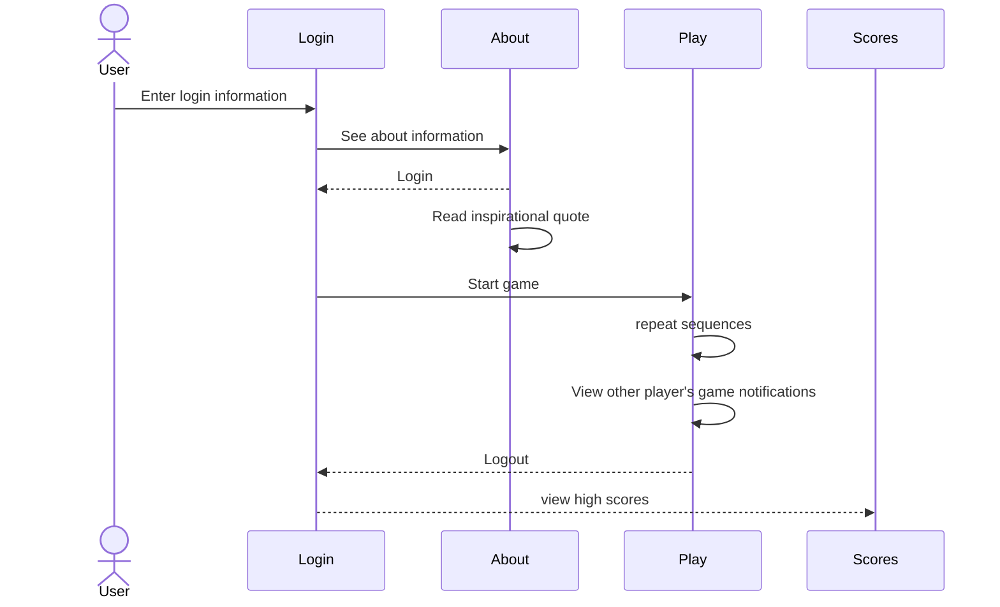

# Simon

[My Notes](notes.md)

In 1978 Milton-Bradley, now Hasbro, released an electronic game named Simon. It was cutting edge at the time since there were so few electronic games, and all the cool kids had one.

We are going to build a peer to peer multiplayer web application modeled after Simon. We will build it together by adding new functionality every time we learn a new technology. The example version of code and production deployment for each iteration are available to you. Your job will be to review the example and then deploy it to your production environment. The goal is to make you think about every line of code. Ask, "why is it done this way?" and "Is there a better way?". You can then take what you have learned, or even portions of the Simon code, and apply it to your Startup application.

## 🚀 Specification Deliverable

Simon is a simple game where you repeat a sequence of color flashes. The longer sequence you repeat the higher your score is.

For this deliverable I did the following. I checked the box `[x]` and added a description for things I completed.

- [x] Proper use of Markdown
- [x] A concise and compelling elevator pitch
- [x] Description of key features
- [x] Description of how you will use each technology
- [x] One or more rough sketches of your application. Images must be embedded in this file using Markdown image references.

### Elevator pitch

A mind is a beautiful thing, but it needs stimulation. Lights, color, sound, and action. Simon give you hours of fun as you complete to remember the longest sequence of colors. See if you can top the charts with you efforts. Receive automatic notification of how your friends are doing.

### Design

Lorem ipsum dolor sit amet, consectetur adipiscing elit, sed do eiusmod tempor incididunt ut labore et dolore magna aliqua. Ut enim ad minim veniam, quis nostrud exercitation ullamco laboris nisi ut aliquip ex ea commodo consequat. Duis aute irure dolor in reprehenderit in voluptate velit esse cillum dolore eu fugiat nulla pariatur. Excepteur sint occaecat cupidatat non proident, sunt in culpa qui officia deserunt mollit anim id est laborum.

### Key features

- Login, logout, and register
- See high scores
- Receive notifications for other player's achievements
- Play by repeating color sequences
- See a description of the app
- Read inspirational quotes

### Technologies

I am going to use the required technologies in the following ways.

- **HTML** - Four different views, login/register controls, play, scoreboard, and about.
- **CSS** - Complementary color scheme, responsive design, button highlighting during play.
- **React** - Single page application with routing between views, reactive user controls, and state hooks.
- **Service** - Endpoints for authentication, storing/retrieving scores. Third party call to get inspirational quotes.
- **DB/Login** - Stores authentication and scores.
- **WebSocket** - Broadcast user's game notifications.

## 🚀 AWS deliverable

For this deliverable I did the following. I checked the box `[x]` and added a description for things I completed.

- [x] **Server deployed and accessible with custom domain name** - [My server link](https://simon.cs260.click).

## 🚀 HTML deliverable

For this deliverable I did the following. I checked the box `[x]` and added a description for things I completed.

- [x] **HTML pages** - Four different pages. One for each view. `index.html` (Login), `play.html`, `scores.html`, and `about.html`.
- [x] **Proper HTML element usage** - I spent a lot of time learning about elements. I used header, footer, main, nav, img, a, fieldset, input, button, form, and many more.
- [x] **Links** - Links between views.
- [x] **Text** - About page has text.
- [x] **3rd party API placeholder** - About page has a place to display an inspirational quote.
- [x] **Images** - Image is displayed on the about page.
- [x] **Login placeholder** - Placeholder for auth on the login page.
- [x] **DB data placeholder** - High scores displayed on scores page.
- [x] **WebSocket placeholder** - The play page has a text area that will show what other user notifications.
